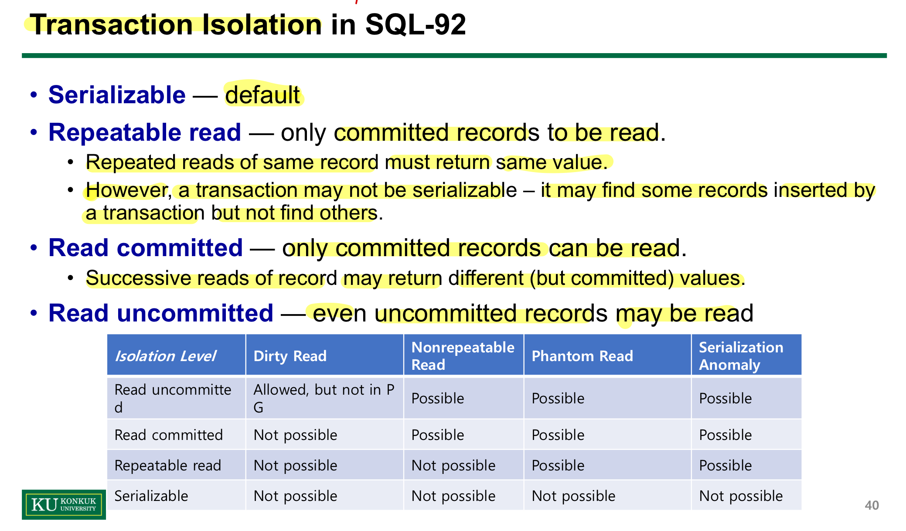
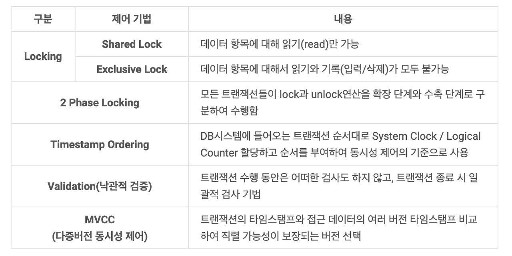
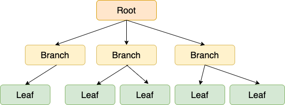
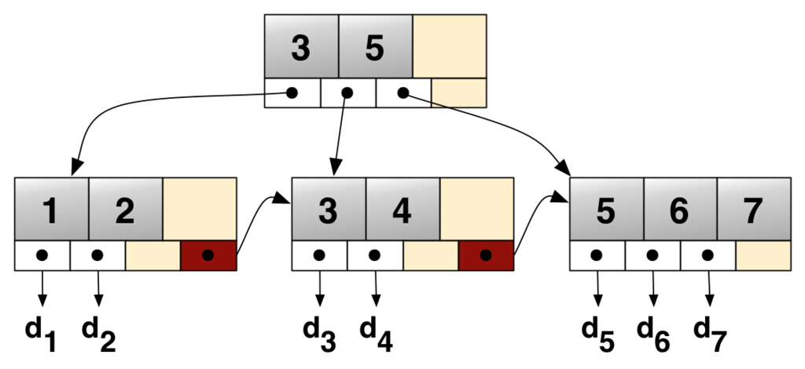
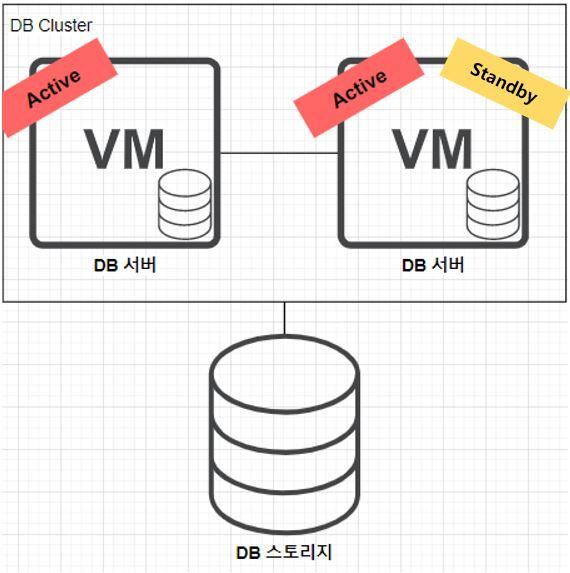
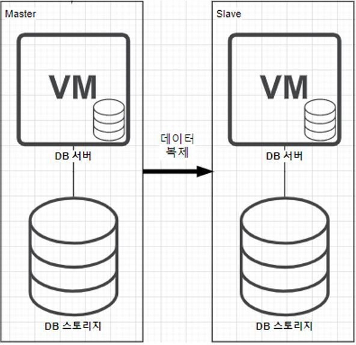
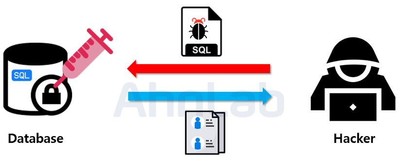

# 개발자 기술면접 질문 정리 - 데이터베이스

## 데이터베이스 기본

### DBMS란
DBMS란 DataBase Management System의 약자로, 데이터를 관리하는 시스템

### DMBS 사용하는 이유
데이터를 저장할 떄, DBMS가 없다면 아마 파일 시스템에 저장할 것.
파일 시스템에 데이터를 저장할 경우, 데이터를 추가하거나 삭제하는 과정에서 데이터의 Redundancy(중복성), Inconsistency(불일치)가 생기고 데이터의 Isolation(고립성)을 보장할 수 없음.
또한, Integrity(무결성), Atomicity(원자성), Concurrent-access(동시 접근), Security(보안)을 보장할 수 없음.

- Redundancy(중복성) : 동일한 데이터가 여러 위치에 중복되어 저장되는 것. 예를 들어, 고객 정보가 여러 데이터베이스 테이블에 중복 저장되어 있을 경우.
- Inconsistency(불일치) : 어떤 데이터를 변경했을 때, 변경되어야 하는 관련된 데이터는 변경되지 않는 것. 예를 들어, 고객의 주소가 변경되었을 때 모든 관련 테이블에서 주소가 업데이트되지 않는 경우.
- Isolation(고립성) : 데이터의 처리에 각 트랜잭션은 서로 독립적으로 수행되어야 하며, 다른 트랜잭션의 중간 결과를 볼 수 없어야 함. (데이터의 일관성 유지)
- Integrity(무결성) : 데이터가 정확하고 일관성 있는 상태를 유지하려는 성질. 예를 들어, 고객의 계좌 잔액은 음수가 될 수 없음
- Atomicity(원자성) : 데이터에 대한 트랜잭션은 일어나거나 일어나지 말아야 함(무결성 보장). 예를 들어 A계좌에서 B계좌로 돈을 입금하는 경우, 이러한 작업은 하나의 트랜잭션으로 묶여 원자성을 보장하여 처리되어야 함
- Concurrent-access(동시 접근) : 여러명의 user가 하나의 데이터에 접근했을 때, 각 transaction을 격리할 수 있어야 함. 예를 들어, 두 사용자가 동시에 같은 계좌에서 돈을 인출하려 할 때, 각 트랜잭션이 서로에게 영향을 주지 않도록 처리하는 것.
- Security(보안) : Role Based Access Control(역할 기반 제어 접근, RBAC)를 원칙으로 하여, 사용자마다 볼 수 있는 데이터를 제한할 수 있어야 함.

### 데이터베이스의 Schema 와 Instance
- Schema : 데이터베이스의 구조를 정의하는 메타데이터의 집합으로 데이터베이스에 어떤 데이터가 저장될 수 있는지, 데이터의 형식, 관계, 제약 조건 등을 설명함. 예를 들어 고객 데이터는 이름, 나이, 주소 등의 정보를 가져야 하며, 이름은 빈 값이면 안되고 나이는 0보다 커야 하는 등의 제약 조건을 정의한 것.
- Instance : 특정 시점에서 데이터베이스의 스키마에 따라 실제로 저장된 데이터 자체.

### Physical data independence
데이터베이스의 스토리지의 파일 시스템 형식이 변하더라도, 데이터베이스의 스키마와 엑세스 방법은 변경되지 않아야 함.

### Relational Model
관계형 데이터베이스는 attributes(or columns)와 tuples(or rows)의 집합으로 이루어짐.
- Attributes(fields) : 데이터베이스의 column으로, 데이터베이스의 도메인의 특성을 충족해야함. 예를 들어 나이 Attribute는 0보다 큰 정수여야 한다.
- tuples(records) : 데이터베이스의 row로, 데이터베이스의 각 attribute에 맞게 정의된 하나의 인스턴스를 의미함

### Key
- Super Key : 데이터베이스의 레코드를 구분할 수 있는 attribute의 부분 집합. 이 중 여러개의 필드가 묶인 key를 복합키라고 함.
- Candidate Key : Super Key 중에서 Primary Key로 선택될 수 있는 부분 집합으로, 유일성과 최소성을 보장해야 함
    - 유일성 : 해당 필드에서 중복된 값이 존재하지 않아야 함
    - 최소성 : 최소한의 필드로 테이블의 레코드를 구분할 수 있어야 함
- Primary Key : Candidate Key 중에서 데이터베이스의 모든 레코드를 구분할 수 있는 고유의 식별자로 중복된 값이나 null 값은 존재하지 않아야 한다. 후보키 중에 되도록 단순하고 변경되지 않는 값을 선택해야 한다.
- Alternate Key : 후보키 중 Primary Key를 제외한 나머지 키
- Foreign Key : 한 테이블의 키 중에서 다른 테이블의 레코드를 유일하게 식별할 수 있는 키. 참조하는 테이블에서 하나의 필드 혹은 여러개의 필드의 부분집합이 될 수 있으며 null 값을 가질 수 있다. 하지만 참조하는 테이블에서 Foreign Key는 참조되는 테이블에서 Candidate Key로 레코드를 식별할 수 있어야 한다.

> 데이터베이스에서는 참조 무결성을 위해 참조 대상이 존재하지 않는 외래 키를 허용하지 않습니다. 즉, 어떠한 외래 키 BB가 AA를 참조한다면, AA는 반드시 데이터베이스에 존재해야 합니다. 외래 키는 참조 무결성을 지키기 위해 RESTRICTED와 CASCADE, SET NULL이라는 개념을 외래 키에 적용할 수 있도록 기능을 제공합니다. <br>
> - RESTRICTED: 레코드를 변경 또는 삭제하고자 할 때 해당 레코드를 참조하고 있는 개체가 있다면, 변경 또는 삭제 연산을 취소한다. <br>
> - CASCADE: 레코드를 변경 또는 삭제하면, 해당 레코드를 참조하고 있는 개체도 변경 또는 삭제된다. <br>
> - SET NULL: 레코드를 변경 또는 삭제하면, 해당 레코드를 참조하고 있는 개체의 값을 NULL로 설정한다.


---


## Transaction

### 트랜잭션이란 ?
트랜잭션이란 데이터베이스의 상태를 변화 시키는 하나의 논리적인 작업 단위를 의미합니다.
트랜잭션에 포함된 쿼리의 수와 관계없이, 트랜잭션은 100% 실행되거나 실행되지 않아야 합니다.

### 트랜잭션의 특징 (ACID)
- Atomicity : 트랜잭션을 구성하는 모든 연산 자체는 실행되거나 실행되지 않아야 합니다.
- Consitency : 트랜잭션이 성공적으로 실행되면, 항상 데이터베이스의 일관된 상태를 유지해야 합니다.
- Isolation : 서로 다른 트랜잭션이 동시에 수행될 떄, 각 트랜잭션은 서로의 중간 결과를 볼 수 없어야 합니다.
- Durability : commit된 트랜잭션의 내용은 영구적으로 보관되어야 합니다.

### 트랜잭션의 상태
- Active(활동) : 트랜잭션이 진행중인 상태
- Partially Committed(부분 완료) : 트랜잭션의 마지막 연산까지 실행되었지만, commit 연산은 실행되지 않은 상태
- Failed(장애) : 트랜잭션 실행 중 오류가 발생하여, 트랜잭션이 중단된 상태
- Committed(완료) : 트랜잭션이 성공적으로 완료되어, Commit된 상태
- Aborted(철회) : 트랜잭션이 실패하여, Rollback을 수행하는 상태

```
Active -> Partially Committed -> Committed
Active, Partially Committed -> Failed
Failed -> Aborted
```

### 동시에 트랜잭션이 실행될 떄 발생하는 현상
- Dirty Read
    - 하나의 트랜잭션이, 다른 트랜잭션이 commit되지 않은 데이터를 읽는 것
    - 예를 들어, 트랜잭션 A 가 User A의 이름을 변경하는 연산을 수행하고 commit되지 않은 상태에서, 트랜잭션 B가 A의 변경된 이름을 읽었는데, 트랜잭션 A가 Rollback을 수행한다면 트랜잭션 B는 변경된 이름을 읽는 연산을 수행함.
- Nonrepeatable Read 
    - 하나의 트랜잭션이 동일한 쿼리를 두 번 이상 실행할 때, 첫 번째 쿼리 실행결과와 두 번째 쿼리 실행 결과가 다른 현상 (수정)
    - 예를 들어, 트랜잭션 A에서 데이터 B를 두 번 이상 조회하는 연산을 실행할 때, 트랜잭션 B가 동시에 실행되어 데이터 B를 변경한다면, A가 같은 쿼리로 읽은 결과가 달라질 수 있음.
- Phantom Read
    - 하나의 트랜잭션이 동일한 쿼리를 두 번 이상 실행할 떄, 첫 번째 쿼리의 실행에서는 없던 데이터가 두번 째 쿼리에서 나타나는 현상 (추가)
    - 예를 들어, 트랜잭션 A에서 쿼리를 실행했는데, 첫 번째 쿼리에서 있거나 없던 데이터가 두 번째 쿼리에서는 없거나 새로 생기는 현상
- Serialization anomaly
    - 트랜잭션 그룹이 직렬적으로 수행되면 데이터의 일관성을 보장하지만, 동시에 수행되면 데이터의 일관성을 보장하지 않는 현상 (추가, 삭제, 수정 모두 포함)
    - 트랜잭션 A와 B가 순서대로 실행된다면 데이터의 일관성을 보장하지만, 동시에 수행되면 데이터의 일관성을 보장하지 않는 현상

### 트랜잭션 격리 수준



---


## 동시성 제어

### 동시성 제어 기법 종류


- Lock의 종류
    - Shared Lock(S-Lock) : 읽기 작업에 사용되는 잠금. 여러 트랜잭션이 동시에 읽기 작업을 수행할 수 있음.
    - Exclusive Lock(X-Lock) : 쓰기 작업에 사용되는 잠금. 여러 트랜잭션이 동시에 읽기/쓰지 작업을 수행할 수 없음.

기본적인 Lock의 경우 트랜잭션의 Serializable을 보장하지 못하고 DeadLock이 발생할 수 있다는 문제가 발생.
이 중 Serializable을 보장하기 위해 2PL(Two-Phase Locking) 기법을 사용할 수 있음.

- Two-Phase Locking
    - 확장 단계와 수축 단계로 나누어 Lock을 관리
    - 확장 단계 (Growing Phase) : 트랜잭션이 진행되면서 Lock을 획득하는 단계
    - 수축 단계 (Shrinking Phase) : 트랜잭션이 종료되면서 Lock을 해제하는 단계
    - 2PL 의 종류
        - **Strict 2PL:**  X-Lock에 대해서만 2PL 적용. Serializable을 보장하지만 Cascading Rollback이 발생할 수 있음.
        - **Rigorous 2PL:**  X-Lock과 S-Lock 모두 2PL 적용. Serializable을 보장하고 Cascading Rollback을 방지할 수 있지만, 동시성이 떨어짐. 거의 모든 데이터베이스에서 2PL을 Rigorous 2PL로 구현함.

- Cascading Rollback
    - **정의:** 한 트랜잭션이 실패하여 롤백을 수행할 때, 이 트랜잭션에 의존적인 다른 트랜잭션들도 함께 롤백되는 현상.
    - **발생 원인:** 트랜잭션 A가 데이터를 수정한 후, 이 데이터를 트랜잭션 B가 읽고 추가 작업을 수행하는 경우, A가 롤백되면 B도 일관성을 유지하기 위해 롤백해야 합니다.
    - **예방 방법:** 
        - 격리 수준 조정 : 격리 수준을 Serializable로 설정하면 됨. 하지만 동시성 확보가 떨어짐
        - 락의 범위 조정 : 락을 필드나 레코드 수준으로 제한하여, 트랜잭션 간의 간섭을 최소화. 하지만 관리가 복잡함
        - Rigorous 2PL 적용

하지만 2PL의 경우 아직까지 DeadLock이 발생할 수 있음.

- Timestamp Ordering 
    - 데이터가 읽기/수정 되는 시간(RTS, WTS)을 표시하여, 트랜잭션 발생 시간 > RTS,WTS 인 경우에만 트랜잭션을 실행. 
    - 실패가 자주 발생하여 동시성이 떨어짐
- Validation(낙관적 검증) 
    - 트랜잭션 동안에는 아무것도 하지않고, 종료 직전에만 다른 트랜잭션과의 충돌 여부를 검사하고, 충돌이 발생하면 트랜잭션을 롤백함
    - 이 방법은 트랜잭션이 충돌할 가능성이 낮을 때만 사용되며, 락을 사용하지 않기 때문에 데드락이 발생하지 않고 시스템의 처리량이 높아짐
    - 하지만, 충돌 발생 시 트랜잭션을 재시작해야하므로, 충돌이 빈번하게 발생하는 상황에서는 성능이 감소
- MVCC(다중버전 동시성 제어)
    - 데이터가 수정될 때마다 버전을 추가하여 동시성을 제어함.
    - 트랜잭션 TA가 A데이터의 1.0 버전을 읽고 변경한 후 1.2 버전으로 고치려고 할떄, A의 버전을 확인하여 1.0버전이면 commit, 다른 버전이면 rollback 후 재실행

### Lock
DB Lock은 트랜잭션 처리의 직렬성을 보장하기 위한 방법으로, 데이터에 접근하기 전에 Lock을 요청해서 Lock이 허락되면 해당 데이터에 접근할 수 있도록 하는 기법이다.

DB Lock의 종류는 크게 두 가지로, 비관적 락과 낙관적 락이 있습니다.

- 비관적 락 (Pessimistic Lock) : 데이터 갱신 시 충돌이 발생할 것으로 예상해 락을 거는 방식
    - 공유락(Shared Lock) : 사용 중인 데이터를 다른 트랜잭션이 읽기 허용, 쓰기 비허용
    - 베타락(Exclusive Lock) : 사용 중인 데이터를 다른 트랜잭션이 읽기, 쓰기 모두 비허용
    - 데이터 수정 즉시 트랜잭션 충돌을 감지할 수 있습니다.
    - 롤백을 개발자가 일일히 하기 힘든 경우, 충돌이 일어났을 때 롤백 비용이 많이 드는 경우, 주문 시에 쿠폰 사용, 알림 제공, 주문서 작성 등 여러 기능이 한 트랜잭션에 묶여있는 경우에 적합합니다.
 
- 낙관적 락 (Optimistic Lock) : 데이터 갱신 시 충돌이 발생하지 않을 것이라 가정해 락을 걸지 않고, 버전 관리 기능을 통해서 트랜잭션 격리성을 관리하는 방식.
    - Version 컬럼을 별도로 추가해서 충돌을 방지합니다. Version 정보를 사용하면 최초 커밋만 인정이 되고, Bulk Insert는 버전을 무시하기 떄문에 Bulk Insert에서 버전을 증가시키려면 버전 필드를 강제로 증가시켜야 합니다.
    - DB가 제공하는 락 기능을 사용하지 않고, JPA가 제공하는 버전 관리 기능(Application Level의 Lock)을 사용합니다.
    - 커밋 전까지는 충돌을 알 수 없습니다.
    - 충돌이 나면 롤백 처리는 개발자의 몫입니다.
 

> 비관적 락과 낙관적 락의 사용 기준은 `읽기와 수정 비율이 어디에 가까운지`입니다. 수정의 비율이 높다면 Pessimistic Lock을, 읽기의 비중이 높다면 Optimistic Lock을 사용합니다.


> Why? <br>
>데이터 수정 즉시 트랜잭션 충돌을 감지하고 롤백이 가능하므로 수정이 많은 경우 비관적 락을 사용하는 것이 좋습니다. <br>
>읽기 작업이 많다면 JPA의 버전관리 기능을 활용해 개발하는 것이 더욱 편리하기 때문에 낙관적 락을 사용하는 것이 좋습니다.

### DeadLock

- DeadLock의 발생 조건
    - 상호 배제 (Mutual Exclusion) : 한 번에 하나의 트랜잭션만 잠금을 획득할 수 있음
    - 점유와 대기 (Hold and Wait) : 잠금을 획득한 트랜잭션이 다른 잠금을 획득하기 위해 대기하는 상태
    - 비선형 순서 (No Preemption) : 잠금을 획득한 트랜잭션이 잠금을 해제하기 전까지 다른 트랜잭션이 잠금을 해제할 수 없음
    - 순환 대기 (Circular Wait) : 트랜잭션들이 잠금을 획득하는 순서를 그래프로 나타내었을 때 싸이클이 발생해야 함. 각 트랜잭션이 다음 트랜잭션이 보유한 잠금을 기다리는 순환적 구조를 형성함을 의미함.

- DeadLock Handling
    - DeadLock Prevention
        - predeclaration : 각 트랜잭션이 시작하기 전에 필요한 모든 데이터의 lock을 획득함 (동시성 저하)
        - graph-based protocol : wait-for graph를 사용하여 트랜잭션 간의 대기 상태를 그래프로 표현하고, 이를 통해 순환 대기 상태를 파악합니다. 순환 대기가 발견되면, 해당 순환을 포함하는 트랜잭션 중 하나 이상을 롤백하여 데드락을 해결하고 순환 대기를 방지합니다.
        - wait-die : older 트랜잭션은 younger 트랜잭션이 release 하기를 기다리지만, younger 트랜잭션은 절대 기다리지 않고 roll back.
        - wound-wait : older 트랜잭션이 younger 트랜잭션을 wound(force rollback)하고, younger 트랜잭션은 older 트랜잭션이 release 하기를 기다릴 수 있다.
        - Timeout based : 트랜잭션은 오직 정해진 시간동안만 wait하고, 그 시간이 넘어가면 roll-back 한다.
    - DeadLock Detection & Recovery
        - wait-for graph(dection) : Wait-for graph를 사용하여 순환 대기를 감지
        - Rollback (Recovery) 
            - Total rollback : 모든 트랜잭션을 Rollback하고 다시 시작
            - Partial rollback : wait-for graph에서 싸이클이 있는 트랜잭션만 rollback

> wait-die와 wound-wait는 starvation을 방지할 수 있지만, Timeout based는 starvation이 발생할 수 있음


---


## 무결성, 무결성 제약조건
데이터의 무결성은 데이터가 정확성, 일관성, 유효성이 유지되는 것
- 정확성(Accuracy) : 
    - 데이터가 실제로 정확하고 오류가 없는 상태
    - 예를 들어, 100원을 이체하는 연산이 있을 경우, 정확하게 100원이 이체되어야 함
- 일관성(Consistency)
    - 데이터베이스의 다양한 부분에서 데이터가 모순 없이 일관되게 유지되어야 하는 상태
    - 예를 들어, 졸업한 학생인데 수강중인 과목을 입력하면 안됨
- 유효성(Validity)
    - 데이터가 정의된 형식, 규칙, 제약조건에 따라 유효해야함
    - 예를 들어, 이메일인데 @가 없으면 유효하지 않음

무결성 제약조건은 데이터의 무결성을 유지하기 위한 조건으로, 데이터베이스의 무결성을 유지하기 위해 사용되는 제약조건입니다.

- 개체 무결성(Entity Integrity)
    - 각 테이블의 기본키는 유일해야 함
    - 기본키는 null 값을 가질 수 없음
- 참조 무결성(Referential Integrity)
    - 외래키는 참조하는 테이블의 기본키여야 함
    - 외래키는 null 값을 가질 수 있음
    


---


## Query

### 기본 SQL

- SELECT (데이터 조회)
```sql
-- 모든 사용자 조회
SELECT * FROM users;

-- 특정 열만 조회
SELECT name, email FROM users;

-- 조건부 조회
SELECT * FROM users WHERE age > 30;

-- 정렬하여 조회
SELECT * FROM users ORDER BY age DESC;

-- 중복 제거하여 조회
SELECT DISTINCT department FROM users;
```

- INSERT (데이터 삽입)
```sql
-- 단일 행 삽입
INSERT INTO users (id, name, age, email, department) 
VALUES (1, '김철수', 27, 'kim@example.com', '개발');

-- 여러 행 삽입
INSERT INTO users (id, name, age, email, department) 
VALUES 
(2, '이영희', 32, 'lee@example.com', '마케팅'),
(3, '박민수', 45, 'park@example.com', '인사');
```

- UPDATE (데이터 수정)
```sql
-- 특정 사용자 정보 수정
UPDATE users 
SET age = 28, department = '디자인'
WHERE id = 1;

-- 모든 사용자의 특정 정보 수정
UPDATE users
SET department = '개발2팀'
WHERE department = '개발';
```

- DELETE (데이터 삭제)
```sql
-- 특정 사용자 삭제
DELETE FROM users 
WHERE id = 3;

-- 특정 조건의 데이터 삭제
DELETE FROM users 
WHERE age < 25;
```

- 서브쿼리(Subquery)
```sql
-- 평균 나이보다 많은 사용자 조회
SELECT * FROM users
WHERE age > (SELECT AVG(age) FROM users);

-- 가장 최근에 주문한 사용자 조회
SELECT * FROM users
WHERE id IN (
    SELECT user_id FROM orders
    WHERE order_date = (SELECT MAX(order_date) FROM orders)
);
```

- UNION (합집합)
```sql
-- 30대 이상 사용자와 개발 부서 사용자의 합집합
SELECT * FROM users WHERE age >= 30
UNION
SELECT * FROM users WHERE department = '개발';
```


### SQL 실행 순서
1. FROM 절
쿼리에서 데이터를 가져올 테이블이나 뷰를 결정합니다. 이 단계에서 조인이 발생하면, 관련된 모든 테이블이 결합됩니다.
2. ON 절
조인 조건이 지정되어 있다면, 이 조건에 따라 테이블이 결합됩니다. 이는 FROM 절에 명시된 테이블들 사이의 관계를 정의합니다.
3. JOIN
여러 테이블을 결합하는 작업이 수행됩니다. 이는 FROM 절 다음에 처리되며, ON 절의 조건에 따라 테이블이 결합됩니다.
4. WHERE 절
특정 조건에 맞는 행을 필터링합니다. 이 단계에서 지정된 조건을 만족하는 데이터만이 다음 단계로 넘어갑니다.
5. GROUP BY 절
지정된 열을 기준으로 데이터를 그룹화합니다. 이는 집계 함수(COUNT, SUM, AVG 등)와 함께 사용되어 각 그룹에 대한 계산을 수행합니다.
6. HAVING 절
GROUP BY 절에 의해 생성된 그룹에 대해 추가적인 필터링을 수행합니다. 이는 WHERE 절과 유사하지만, 그룹화된 결과에 대해 작동합니다.
7. SELECT 절
최종적으로 선택된 열이나 표현식을 계산합니다. 이 단계에서는 SELECT 절에 명시된 열이나 계산된 결과가 처리됩니다.
8. DISTINCT
중복된 결과를 제거합니다. SELECT DISTINCT가 사용된 경우, 이 단계에서 중복된 행이 제거됩니다.
9. ORDER BY 절
결과를 특정 열을 기준으로 정렬합니다. 이는 거의 마지막 단계에서 수행되며, 최종 결과를 사용자가 요구한 순서대로 정렬합니다.
10. LIMIT / OFFSET 절
결과의 특정 수의 행만을 반환하거나, 특정 위치에서부터 행을 반환합니다. 이는 최종 결과에 대한 제한을 두거나, 페이징 처리에 사용됩니다.

### Join
조인은 관계형 데이터베이스에서 두 개 이상의 테이블을 연결하여 데이터를 검색하는 방법

조인의 종류로는 inner join과 outer join이 있음

- Inner Join
    - 두 테이블의 교집합을 반환
    - 예: `SELECT A.*, B.* FROM A INNER JOIN B ON A.key = B.key;`

- Outer Join
    - 한 테이블의 모든 데이터와 다른 테이블의 일치하는 데이터를 반환. 일치하지 않는 경우 NULL 값을 포함.
    - 종류
        - Full Outer Join: 두 테이블의 모든 데이터를 반환하며, 일치하지 않는 경우 해당 필드는 NULL로 표시.
          - 예: `SELECT A.*, B.* FROM A FULL OUTER JOIN B ON A.key = B.key;`
        - Left Outer Join: 왼쪽 테이블(A)의 모든 데이터와 오른쪽 테이블(B)의 일치하는 데이터를 반환. B에 일치하는 데이터가 없는 경우, B의 필드는 NULL로 표시.
          - 예: `SELECT A.*, B.* FROM A LEFT OUTER JOIN B ON A.key = B.key;`
        - Right Outer Join: 오른쪽 테이블(B)의 모든 데이터와 왼쪽 테이블(A)의 일치하는 데이터를 반환. A에 일치하는 데이터가 없는 경우, A의 필드는 NULL로 표시.
          - 예: `SELECT A.*, B.* FROM A RIGHT OUTER JOIN B ON A.key = B.key;`


### Aggregation Functions, Group By, Having
GROUP BY 는 GROUP BY 명령어를 통해 특정 컬럼을 기준으로 연산한 결과를 집계 키로 정의하여 그룹을 짓는 역할을 함
집합 연산자는 COUNT, SUM, AVG, MAX, MIN 등이 있고, DISTINCT와 같이 중복 데이터를 제거하는 특징이 있음.

- 집계 함수 (Aggregation Functions)
```sql
-- 부서별 직원 수
SELECT department, COUNT(*) AS 인원수
FROM users
GROUP BY department;

-- 부서별 평균 나이
SELECT department, AVG(age) AS 평균나이
FROM users
GROUP BY department;

-- 전체 최대 나이
SELECT MAX(age) AS 최대나이
FROM users;

-- 전체 최소 나이
SELECT MIN(age) AS 최소나이
FROM users;

-- 전체 나이 합계
SELECT SUM(age) AS 나이합계
FROM users;

-- 부서별 나이 합계
SELECT department, SUM(age) AS 나이합계
FROM users
GROUP BY department;

-- 부서별 최대 나이
SELECT department, MAX(age) AS 최대나이
FROM users
GROUP BY department;

-- 부서별 최소 나이
SELECT department, MIN(age) AS 최소나이
FROM users
GROUP BY department;
```

- GROUP BY (그룹화)
```sql
-- 부서별 인원 수
SELECT department, COUNT(*) as 인원수
FROM users
GROUP BY department;

-- 부서별 평균 나이
SELECT department, AVG(age) as 평균나이
FROM users
GROUP BY department;
```

- HAVING (그룹 조건)
```sql
-- 평균 나이가 30 이상인 부서 조회
SELECT department, AVG(age) as 평균나이
FROM users
GROUP BY department
HAVING AVG(age) >= 30;
```


### DELETE, TRUNCATE, DROP
- DELETE는 데이터는 지우지만 테이블 용량은 줄어들지 않고 원하는 데이터만 골라서 지울 수 있습니다. 삭제 후 되돌릴 수 있습니다.
- TRUNCATE는 전체 데이터를 한번에 삭제하는 방식입니다. 테이블 용량이 줄어들고 인덱스 등도 삭제되지만 테이블은 삭제할 수 없고,  삭제 후 되돌릴 수 없습니다.
- DROP은 테이블 자체를 완전히 삭제하는 방식(공간, 인덱스, 객체 모두 삭제)입니다. 삭제 후 되돌릴 수 없습니다.

```sql
-- users 테이블에서 age가 30 이하인 모든 사용자 삭제
DELETE FROM users WHERE age <= 30;

-- users 테이블의 모든 데이터를 삭제
TRUNCATE TABLE users;

-- users 테이블 삭제
DROP TABLE users;
```


### 트리거
- 트리거는 특정 테이블에 반응해 INSERT, DELETE, UPDATE 같은 DML이 수행되었을 때, 데이터베이스에서 자동으로 동작하도록 작성된 프로그램(메서드 형식의 쿼리)으로, 사용자가 직접 호출하지 않고 DB에서 자동적으로 호출된다는 특징이 있습니다.
- DML이 실행되고, 자동으로 정의된 프로시저가 실행됩니다.

> 프로시저 : 쿼리문을 마치 하나의 메서드 형식으로 만들고 어떤 동작을 일괄적으로 처리하는 용도.

- INSERT 후 실행되는 트리거 : 새로운 사용자가 users 테이블에 추가될 때마다, created_at 필드를 현재 시간으로 자동 설정하는 트리거
```sql
CREATE TRIGGER SetCreatedDate
AFTER INSERT ON users
FOR EACH ROW
BEGIN
    UPDATE users SET created_at = CURRENT_TIMESTAMP WHERE user_id = NEW.user_id;
END;
```

- DELETE 전 실행되는 트리거 : users 테이블에서 사용자가 삭제되기 전에 로그를 남기는 트리거
```sql
CREATE TRIGGER LogBeforeUserDeletion
BEFORE DELETE ON users
FOR EACH ROW
BEGIN
    INSERT INTO deletion_logs(user_id, name, deleted_at)
    VALUES (OLD.user_id, OLD.name, CURRENT_TIMESTAMP);
END;
```

- UPDATE 후 실행되는 트리거 : users 테이블의 email 필드가 변경될 때마다 변경 로그를 기록하는 트리거
```sql
CREATE TRIGGER LogEmailChange
AFTER UPDATE OF email ON users
FOR EACH ROW
WHEN (OLD.email <> NEW.email)
BEGIN
    INSERT INTO email_change_logs(user_id, old_email, new_email, changed_at)
    VALUES (OLD.user_id, OLD.email, NEW.email, CURRENT_TIMESTAMP);
END;
```


### DDL, DML, DCL
- DDL(정의어, Data Definition Language) : 데이터베이스 스키마를 정의, 수정, 삭제하는 언어 (ALTER, CREATE, DROP)
- DML(조작어, Data Manipulation Language) : DB내의 자료 검색, 삽입, 갱신, 삭제를 위한 언어 (SELECT, INSERT, UPDATE, DELETE)
- DCL(제어어, Data Control Language) : 데이터에 대해 무결성 유지, 병행 수행 제어, 보호와 관리를 위한 언어 (COMMIT, ROLLBACK, GRANT, REVOKE)


---


## Indexing

### DB 인덱스란 ?
- Index는 테이블을 처음부터 끝까지 검색하지 않고, 인덱스를 검색해서 해당 자료의 테이블을 접근하는 방법을 의미합니다.
- Index는 항상 정렬된 상태를 유지하기 때문에 원하는 값을 검색하는 데 빠른 장점을 가지고 있지만, 새로운 값을 추가하거나 삭제, 수정하는 경우에는 쿼리문 실행 속도가 느려집니다. (인덱스도 변경하고 정렬해야 하므로 성능 저하)
- 즉, 인덱스는 데이터의 저장 성능을 희생하는 대신, 데이터의 검색 속도를 높이는 기능입니다.
- 인덱스 생성(INDEX) 쿼리
```sql
-- 이메일에 인덱스 생성
CREATE INDEX idx_user_email ON users(email);

-- 복합 인덱스 생성
CREATE INDEX idx_user_dept_age ON users(department, age);
```

### Index의 B+트리
- B+ 트리 자료구조는 B 트리를 확장한 자료구조

- B 트리 : 
    - 이진트리를 확장해서 많은 자식을 갖을 수 있는 균형 트리를 의미
    - Key들이 항상 오름차순으로 정렬되어 구성
    - Branch와 Leaf 노드가 Key와 Data를 저장하는 구조



- B+ 트리 
    - B-트리를 확장해서 데이터의 빠른 접근을 위한 인덱스 역할만 하는 비단말 노드를 추가한 트리.
    - Branch 노드는 Key만 저장하게 되며, Key들이 항상 오름차순으로 정렬되어 구성된다.
    - 하나의 노드에 더 많은 Key를 담을 수 있도록 하여 B-트리에 비해 B+트리의 높이가 더욱 낮아지게 된다. (cache hit를 높인다)
    - Leaf노드는 Key와 Data를 저장하고, Linked List로 연결되어 있습니다. Full scan시 B-트리는 리프노드끼리 연결되어 있지 않기때문에 모든 노드를 확인해야 하지만, B+트리의 경우 리프노드에 연결된 연결리스트로 선형 검색이 가능하기 때문에 검색 측면에서 좋은 효율을 보인다.




### 해시 인덱스 방식과 B+트리 인덱스 방식의 차이
- 해시 인덱스 방식은, 칼럼 값으로 생성된 해시를 기반으로 인덱스를 구현하므로 시간복잡도가 O(1)로 굉장히 빠릅니다. 하지만 일반적으로 B+트리로 인덱스를 구현하는 이유는, 해시 테이블은 '동등 연산(=)'에 특화된 자료구조이며, '부등호 연산'에서는 연산시 성능 저하가 일어납니다.
- 동등 비교에서는 해시 인덱스가 효과적
- 그러나 범위 검색(부등호 연산)에서는 B+트리 인덱스가 정렬되어 있기 때문에 효과적


---

## Normalization

### 정규화란?
정규화(Normalization)의 기본 목표는 테이블 간에 중복된 데이터를 허용하지 않는다는 것이다. 
중복된 데이터를 허용하지 않음으로써 무결성(Integrity)를 유지할 수 있으며, DB의 저장 용량 역시 줄일 수 있다.

### 제1 정규화
제1 정규화란 `테이블의 컬럼이 원자값(Atomic Value, 하나의 값)을 갖도록` 테이블을 분해하는 것이다. 
예를 들어, 취미들 테이블에 여러 취미가 존재한다면 모두 나누어야 함.

### 제 2 정규화
제2 정규화란 제1 정규화를 진행한 테이블에 대해 `완전 함수 종속을 만족하도록 테이블을 분해`하는 것이다. 
여기서 `완전 함수 종속이라는 것은 기본키의 부분집합이 결정자가 되어선 안된다는 것`을 의미한다.
예를 들어, 기본 키가 (이름, 학교)이고 이것이 (성적, 학교위치)를 결정할 떄, (학교)를 통해 (학교 위치)를 결정할 수 있으므로, 
(이름, 학교, 성적) 테이블과 (학교, 학교위치) 테이블로 나눠야 한다.

### 제 3 정규화
제3 정규화란 제2 정규화를 진행한 테이블에 대해 `이행적 종속을 없애도록 테이블을 분해`하는 것이다. 
여기서 이행적 종속이라는 것은 A -> B, B -> C가 성립할 때 A -> C가 성립되는 것을 의미한다.
예를 들어, 기본 키가 (이름)이고 이것이 (학교, 학교위치)를 결정할 때, (학교) -> (학교 위치)인 Function Dependency가 존재하므로,
(이름, 학교)와 (학교, 학교위치) 테이블로 나뉘어야 한다.

### BCNF 정규화
BCNF 정규화란 제3 정규화를 진행한 테이블에 대해 `모든 결정자가 후보키가 되도록 테이블을 분해`하는 것이다.  
즉, 모든 비후보키 속성이 후보키에만 함수적으로 종속되어야 하며, 후보키가 아닌 어떤 속성도 다른 속성을 결정해서는 안 됩니다.
예를 들어, (강의실, 강의 시간)이 기본 키이고, 이 기본키가 (강사)를 결정할 때,
(강사) -> (강의 시간) 이므로 강사는 강의 시간을 결정하는 결정자 이지만 후보키가 아니다.
따라서 (강의실, 강사)와 (강사, 강의 시간) 테이블로 나뉘어야 한다.
이때 (강의실, 강사) 테이블은 기본 키가 (강의실, 강사)이고,
(강사, 강의 시간) 테이블의 기본키는 (강사)가 된다.
 

### 정규화의 장단점
- 장점
    - 데이터 중복을 제거하여 저장 공간을 절약할 수 있음.
    - 데이터 중복을 제거하여 무결성을 유지할 수 있음 -> 중복 데이터가 없기 때문에 데이터를 업데이트할 때 일관성을 유지하기 쉬움
    - 데이터베이스의 스키마를 변경하거나 확장할 때, 정규화된 구조는 변경을 최소화하거나 일부만 변경해도됨 -> 유지 보수성 향상
    - 데이터베이스에서 데이터를 추가, 삭제, 수정할 때 발생할 수 있는 이상 현상(삽입 이상, 삭제 이상, 갱신 이상)을 방지할 수 있음
- 단점
    - 조회 성능 저하: 데이터가 여러 테이블로 분리되어 있기 때문에, 데이터를 조회할 때 여러 테이블을 조인해야 하는 경우가 많다. 이러한 join 연산은 읽기 성능을 저하시킨다.
    - 조회 쿼리의 복잡성 증가: 여러 테이블에 걸쳐 있는 데이터를 조합해야 하므로, SQL 쿼리가 복잡해질 수 있다.

### 역정규화란 ?
- 정규화를 하면 테이블이 여러 개의 테이블로 나눠서 join연산이 많아져 성능이 저하됨.
- 그래서 정규화된 두 개의 테이블을 하나로 합쳐, 어느정도 중복된 값을 허용하여 데이터의 일관성을 희생시켜, 성능을 향상 시키는 것


---


## Etc.


### Connection Pool이란?
- Client의 요청에 따라 각 Application의 Thread에서 DB에 접근하기 위해서는 Connection이 필요하다.
- 커넥션 풀은, 미리 일정 수의 Connection을 생성해 Pool에 보관해 두는 것을 의미한다.
- 요청이 올 때마다 Connection을 생성하는 방식은, 연결량이 많을 때 서버에 과부하가 걸리게 되는 현상이 발생한다.
- 미리 만들어 Pool에 저장하면 이러한 현상을 방지할 수 있다.
- Connection Pool을 사용하면, 생성 및 소멸에 대한 시간 소요가 없어지기 때문에 효율적이고, 한 번에 사용할 수 있는 커넥션 수가 제어되어 Application이 쉽게 죽지 않는다.


### RDB와 NoSQL
-  RDB(관계형 데이터베이스)
    - 정해진 스키마에 따라 데이터를 '테이블'에 저장하는 데이터베이스
    - 데이터 구조가 보장되어있고, 중복을 피할 수 있습니다.
    - SQL을 사용해 RDBMS에서 데이터를 저장, 수정, 삭제 및 검색할 수 있습니다.
    - 수직적 확장이 가능합니다. (서버의 성능을 향상시키는 것)
    - 관계를 맺고 있는 데이터의 변경이 잦은 경우 / 변경될 여지가 없고, 명확한 스키마가 사용자와 데이터에게 중요한 경우에 사용합니다.
 
- NoSQL
    - 스키마가 없거나, 느슨한 스키마로 데이터 간의 관계 없이 자유로운 형태로 데이터를 저장하는 데이터베이스 (비정형) 
    - 유연하기 때문에 데이터 조정과 새로운 필드 생성이 자유롭습니다.
    - 중복을 계속해서 업데이트 해줘야 하는 단점이 있습니다.
    - 수평적 확장으로 트래픽 분산 및 대용량 처리가 가능합니다.
    - 읽기를 자주하지만 데이터 변경은 자주 없는 경우 / 비정형의 데이터 구조를 가진 경우 / 막대한 양의 데이터에 의해 데이터베이스를 수평적으로 확장해야 하는 경우에 사용합니다.


### Redis의 특징
- Redis는 NoSQL로 싱글쓰레드 인메모리 DB. key-value 형태로 데이터를 저장하며 주로 캐시에 사용.
- 스탭샷을 통해 디스크에 백업할 수 있고, AOF를 통해 모든 작업을 log 파일에 기록하고 서버가 재실행 되면 순차적으로 연산해 데이터를 복구할 수 있음.
- 자료구조를 지원

- AOF(Append Only FIle)
    - Redis에서 AOF(Append Only File)는 데이터의 내구성을 보장하기 위한 기능 중 하나.
    - AOF는 Redis 서버에서 수행된 모든 쓰기 작업(데이터 변경을 일으키는 명령)을 파일에 기록하는 방식으로 작동한다.
    - 이 파일은 Redis가 실행되는 동안 계속해서 쓰기 작업을 추가(append)하는 방식으로 업데이트 된다.
    - 주요 특징
        - `데이터 복구`: Redis 서버가 예기치 않게 종료되었을 경우, AOF 파일을 사용하여 데이터를 복구. 서버 재시작 시, AOF 파일에 기록된 명령들을 순차적으로 실행함으로써 데이터베이스의 상태를 복원.
        - `데이터 안정성` : AOF는 데이터의 손실 위험을 줄이기 위해 디스크에 데이터를 지속적으로 기록. 사용자는 AOF 파일의 동기화 빈도를 설정할 수 있어, 성능과 데이터 안정성 사이의 균형을 조절할 수 있음.
        - `파일 재작성` : 시간이 지남에 따라 AOF 파일은 매우 커질 수 있다. Redis는 불필요한 명령을 제거하고 파일 크기를 최소화하기 위해 주기적으로 AOF 파일을 재작성 할 수 있음.


### 데이터베이스 클러스터링



- DB 클러스터링은 DB 스토리지는 공유하고, 동일한 DB 서버를 여러 대 놓는 방식으로, 동기 방식으로 동기화를 진행.

- Active-Active 방식
    - 여러 대의 DB서버가 트래픽을 분산해서 받는다.
    - 여러 대의 서버가 DB 스토리지를 공유하기 때문에 병목이 생길 수 있다.
- Active-Standby 방식
    - 한쪽은 Standby 상태로 두어 Active 상태의 서버가 죽으면 FailOver되어 전환하는 방식
    - FailOver이 이루어지는 동안 손실이 발생한다.


### Database Master-Slave Replication



- DB 레플리케이션은 DB 서버와 DB 스토리지를 다중화하는 방식으로 DB 클러스터링과는 차이가 있습니다.
- 조회작업은 Slave에서 INSERT, DELETE, UPDATE 작업은 Master에서 수행하면서 트래픽을 분산합니다.
- Slave로 데이터를 옮길 때 비동기 방식으로 동작하기 때문에 일관성 있는 데이터를 얻지 못할 수도 있습니다.
- Master 노드가 다운되면 복구 및 대처가 까다롭습니다.


### 수직 파티셔닝과 수평 파티셔닝(샤딩)
- 서비스의 크기가 점점 커지고 DB에 저장하는 규모가 대용량화 되면서 용량의 한계와 성능의 저하가 발생
- 이러한 이슈를 해결하기 위해 테이블을 파티션이라는 작은 단위로 나눠 관리하는 파티셔닝 기법이 나옴
- 큰 테이블이나 인덱스를 관리하기 쉬운 Partition이라는 작은 단위로 물리적으로 분할하는 것을 의미
 
#### 수직 파티셔닝 (Vertical Partitioning)
- 큰 Table이나 인덱스를 관리하기 쉬운 단위로 분리하는 방식
- 예를 들어, 사람이라는 테이블이 너무 커지게 되면서 사람을 북유럽인, 아시아인, 서유럽인 이렇게 테이블로 분리하는 것이라고 볼 수 있다.
- 장점
    - Insert 시 분리된 파티션으로 분산시켜 경합을 줄임
    - 읽기/쓰기 향상
    - 파티션 별로 백업 및 복구 가능
    - 데이터 전체 검색 시 필요한 부분만 탐색해서 성능 증가
- 단점
    - 인덱스와 테이블을 별도로 파티셔닝 할 수 없다. 즉, 테이블과 인덱스를 같이 파티셔닝 해야한다.
    - 테이블 간 조인 비용 증가

#### 수평 파티셔닝 (Horizontal Partitioning) (샤딩)
- 같은 테이블 스키마를 가진 데이터를 다수의 데이터베이스에 분산하여 저장하는 방식
- 데이터를 잘 분산시키기 위해 고려해야할 것이 Shard Key이고 이를 정하는 방식으로 Hash Sharding, Dynamic Sharding, Entity Group 방식이 있다.
- 샤딩은 복잡도가 매우 높아지므로 다른 방식을 우선적으로 고려해야 한다.


### SQL Injection


- 악의적인 사용자가 보안상의 취약점을 이용해, 임의의 SQL문을 주입하고 실행되게 하여 DB가 비정상적인 동작을 하도록 조작하는 행위를 의미
- Error based SQL Injection, Union based SQL Injection, Boolean based SQL Injection, Time based SQL Injection 등 다양한 공격기법이 있음
- 대응 방안으로는 입력 값에 대한 검증, Prepared Statement 구문 사용, Error Message 노출 금지, 웹 방화벽 사용 등의 방안이 있음


### ORM
- ORM은 객체와 관계형 데이터베이스 매핑의 줄임말. (Object-RDBMS Mapping)
- OOP에서 사용하는 객체라는 개념을 구현한 클래스와 RDB에서 사용하는 데이터 테이블을 서로 매핑하는 것을 의미


### Optimizer
- 옵티마이저는 SQL을 가장 빠르고 효율적으로 수행할 최적의 처리 경로를 생성해주는 DBMS 내부의 핵심 엔진.
- 컴퓨터의 CPU = DBMS의 옵티마이저. 
- 개발자가 SQL을 작성하면 옵티마이저가 실행 계획을 세우고, 최적의 효율을 갖는 계획을 판별해 쿼리를 수행.
- 옵티마이저가 항상 최적의 실행 경로를 보장하는 것은 아니기 때문에, 직접 최적의 실행 경로를 작성해주는 것을 '힌트'라고 한다.
